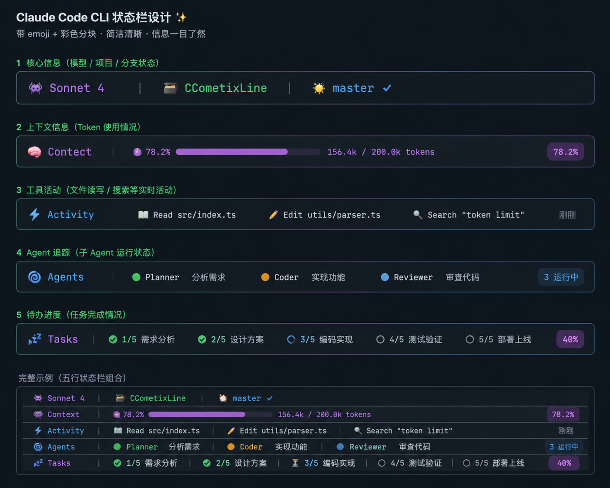

# CC-Fusion

> **Claude Code 5 行状态栏** — 为 [Claude Code](https://docs.anthropic.com/en/docs/claude-code) 设计的极简、富含 emoji 的状态栏，固定 5 行布局，带进度条和实时活动追踪。

一个为 Claude Code 设计的 TypeScript CLI，直接在终端渲染彩色 5 行状态栏 — 一目了然地显示模型信息、上下文使用情况、工具活动、Agent 追踪和任务进度。

🌐 [English](README.md) | 中文文档

---

## 📸 预览




```
👾 Sonnet 4  |  🧰 cc-fusion  |  🌟 main ✅
🧠 Context  ● 78.0%  ▓▓▓▓▓▓▓▓▒▒  168.4k / 200.0k tokens  [78.0%]
⚡ Activity  |  📖 Read src/index.ts  |  ✏️ Edit utils/parser.ts  |  🔍 Search "token limit"  刚刚
🌀 Agents  |  🟢 Planner 分析需求  |  🟠 Coder 实现功能  |  🔵 Reviewer 审查代码  |  3 运行中
💤 Tasks  |  ✅ 1/5 需求分析  |  ✅ 2/5 设计方案  |  ⚡ 3/5 编码实现  |  ⏳ 4/5 测试验证  |  🕒 5/5 部署上线  |  40%
```

### 5 行布局

1. **核心信息** — 👾 模型 | 🧰 项目 | 🌟 Git 分支 + 状态
2. **上下文信息** — 🧠 Token 使用情况，带进度条和百分比
3. **工具活动** — ⚡ 最近的文件读取、编辑和搜索
4. **Agent 追踪** — 🌀 运行中的子 Agent 及状态指示器
5. **待办进度** — 💤 任务完成进度及状态图标

---

## 🚀 安装

### 前置要求

- **Node.js** ≥ 18
- **Claude Code** CLI 已安装
- **Nerd Font**（用于图标）— 推荐：[JetBrains Mono Nerd Font](https://www.nerdfonts.com/)

### 通过 npm 安装

```bash
npm install -g cc-fusion
```

### 手动安装（从源码）

```bash
# 克隆
git clone https://github.com/CanCanNeedNei/cc-fusion.git
cd cc-fusion

# 安装并构建
npm install
npm run build
```

### 配置 Claude Code

在 `~/.claude/settings.json` 中添加：

```json
{
  "statusLine": {
    "type": "command",
    "command": "cc-fusion",
    "padding": 0
  }
}
```

对于手动安装，使用本地构建路径：

```json
{
  "statusLine": {
    "type": "command",
    "command": "node ~/.claude/cc-fusion/dist/index.js",
    "padding": 0
  }
}
```

重启 Claude Code 即可！

---

## 📊 每行显示内容

### 第 1 行：核心信息
- **👾 模型** — 简化的模型名称（Opus 4、Sonnet 4、Haiku 4）
- **🧰 项目** — 当前项目目录名称
- **🌟 Git** — 分支名称 + 状态（✅ 干净、⚠️ 有修改）

### 第 2 行：上下文使用情况
- **🧠 Context** — 标签
- **● 百分比** — 当前上下文使用率
- **进度条** — 可视化表示（▓▓▓▓▓▓▓▓▒▒）
- **Token 计数** — 已使用 / 总计 tokens
- **徽章** — 方括号中的百分比

### 第 3 行：工具活动
- **⚡ Activity** — 标签
- **📖 Read** — 最后读取的文件
- **✏️ Edit** — 最后编辑的文件
- **🔍 Search** — 最后的搜索查询
- **刚刚** — 时间指示器（空闲时显示"空闲中"）

### 第 4 行：Agent 追踪
- **🌀 Agents** — 标签
- **状态点** — 🟢 绿色、🟠 橙色、🔵 蓝色、🟣 紫色、⚪ 白色
- **Agent 信息** — 名称 + 当前任务
- **计数** — 运行中的 Agent 数量（空闲时显示"无活动 Agent"）

### 第 5 行：任务进度
- **💤 Tasks** — 标签
- **状态图标** — ✅ 完成、⚡ 进行中、⏳ 待办、🕒 未开始
- **任务列表** — ID/总数 + 任务名称
- **进度** — 总体完成百分比（空闲时显示"无待办任务"）

---

## 🔍 数据来源

### 1. Claude Code Stdin JSON
主要数据源，每次提示时从 Claude Code 管道传入：
- 模型信息（名称、ID）
- 上下文窗口（输入/输出/缓存 tokens、最大大小）
- 工作目录
- 会话 ID

### 2. Git CLI
通过 `git` 命令收集：
- 当前分支
- 脏状态（未提交的更改）

### 3. Transcript JSONL
从 `~/.claude/projects/` 的 transcript 文件解析：
- 工具调用（Read、Edit、Grep 等）
- Agent 生成
- 任务进度

---

## 🛠️ 开发

```bash
# 监视模式
npm run dev

# 构建
npm run build

# 使用示例 stdin 测试
printf '{"model":{"display_name":"Claude Sonnet 4","id":"claude-sonnet-4"},"context_window":{"total_input_tokens":156400,"total_output_tokens":12000,"context_window_size":200000,"used_percentage":78.2},"cwd":"/Users/user/project"}' | node dist/index.js
```

---

## 📁 架构

```
cc-fusion/
├── src/
│   ├── index.ts          # 入口点：读取 stdin、渲染、输出
│   ├── types.ts          # TypeScript 接口
│   ├── colors.ts         # ANSI 颜色代码
│   ├── utils.ts          # 进度条、格式化器
│   ├── stdin.ts          # 解析 Claude Code stdin JSON
│   ├── git.ts            # 通过 child_process 获取 Git 信息
│   ├── transcript.ts     # 解析 transcript JSONL
│   ├── render.ts         # 主渲染器（组合 5 行）
│   └── lines/
│       ├── line1.ts      # 核心信息渲染器
│       ├── line2.ts      # 上下文渲染器
│       ├── line3.ts      # 活动渲染器
│       ├── line4.ts      # Agents 渲染器
│       └── line5.ts      # Tasks 渲染器
├── package.json
├── tsconfig.json
└── README.md
```

### 设计原则

- **固定布局** — 始终 5 行，无需配置
- **硬编码颜色** — 紫色、橙色、黄色、青色、蓝色调色板
- **Emoji 优先** — 视觉指示器便于快速扫描
- **零配置** — 开箱即用

---

## 📄 许可证

MIT

---

## 🙏 致谢

- 灵感来自 [CCometixLine](https://github.com/Haleclipse/CCometixLine) 和 [Claude HUD](https://github.com/jarrodwatts/claude-hud)
- 为 [Claude Code](https://docs.anthropic.com/en/docs/claude-code) 构建
